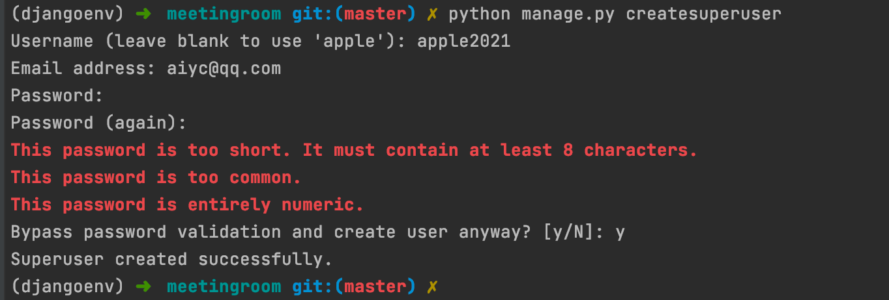

# 使用 Django 创建第一个项目


#### 1. 创建会议室管理项目，项目名为 meetingroom

```python
django-admin startproject meetingroom

cd meetingroom
```

#### 2. 启动项目

```python
python manage.py runserver 0.0.0.0:8080
```

> 0.0.0.0 这个表示监听本机所有的 IP 地址

#### 3. 访问项目
```python
http://127.0.0.1:8080
```

#### 4. 实际操作
```cmake
(djangoenv) ➜  使用Django创建第一个项目 git:(master) ✗ django-admin startproject meetingroom
(djangoenv) ➜  使用Django创建第一个项目 git:(master) ✗ cd meetingroom 
(djangoenv) ➜  meetingroom git:(master) ✗ ls
manage.py   meetingroom
(djangoenv) ➜  meetingroom git:(master) ✗ python manage.py runserver 0.0.0.0:8080
```

#### 4. 数据迁移

首先我们使用 makemigrations 创建数据库迁移，产生 SQL 脚本。然后我们使用 migrate 命令，把默认的 Model 同步到数据库。Django 会自动在数据库里面，为这些 Model 建立相应的表。

```python
python manage.py makemigrations 
python manage.py migrate 
```

#### 5. 创建管理员帐号

```python
python manage.py createsuperuser
```



